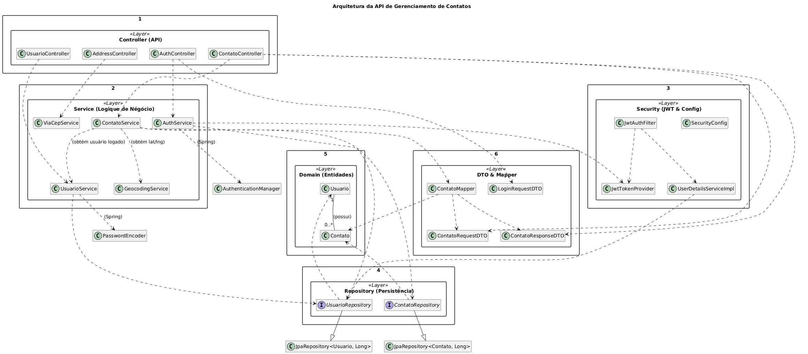

# 🗺️ API de Gerenciamento de Contatos (Desafio Técnico UEX)


## 📚 Sumário

1. [📦 Visão Geral](#-visão-geral)
2. [⚙️ Stack de Tecnologias](#️-stack-de-tecnologias)
3. [🏛️ Arquitetura do Projeto](#️-arquitetura-do-projeto)
4. [🚀 Executando o Projeto (Docker)](#-executando-o-projeto-docker---obrigatório)
5. [🧑‍💻 Modo de Desenvolvimento (IDE + Docker)](#-modo-de-desenvolvimento-ide--docker)
6. [🧪 Testes](#-testes)
7. [🌐 Documentação e Guia de Endpoints](#-documentação-e-guia-de-endpoints)

---

## 📦 Visão Geral

Esta é uma API RESTful completa para o desafio de Desenvolvedor Java Pleno. O sistema permite que usuários se cadastrem, gerenciem uma lista de contatos pessoal e utilizem integrações externas para validação e enriquecimento de dados de endereço.

A aplicação foi construída com foco em **boas práticas**, **arquitetura limpa** e um ambiente **100% containerizado** com Docker Compose.



### Funcionalidades Principais

* ✅ **Autenticação e Autorização:** Sistema completo de Registro, Login e proteção de endpoints usando **Spring Security** e **JWT (JSON Web Tokens)**.
* ✅ **CRUD de Contatos:** Gerenciamento completo (Criar, Ler, Atualizar, Deletar) de contatos, onde cada contato está vinculado ao usuário autenticado.
* ✅ **Validação de CPF:** Algoritmo de validação oficial implementado via anotação customizada (`@CPF`) e `UniqueConstraint` para garantir que um usuário não pode duplicar um CPF.
* ✅ **Integração Google Geocoding:** Ao salvar um contato, a API consulta o Google Maps para obter e persistir a **Latitude e Longitude** exatas do endereço.
* ✅ **Proxy ViaCep:** Um endpoint de backend (`/address`) atua como um proxy obrigatório para a API do ViaCep, permitindo ao frontend buscar endereços por CEP ou logradouro sem expor chaves ou violar o CORS.
* ✅ **Exclusão de Conta:** O usuário pode excluir sua própria conta, o que remove todos os seus dados e contatos associados em cascata.

---

## ⚙️ Stack de Tecnologias

| Ferramenta | Descrição |
| :--- | :--- |
| **Java 21** | Linguagem principal da aplicação. |
| **Spring Boot 3.2.5** | Framework principal para a construção da API, segurança e persistência. |
| **Spring Security (JWT)** | Implementação de segurança para autenticação stateless. |
| **Spring Data JPA** | Persistência de dados com Hibernate. |
| **PostgreSQL 16** | Banco de dados relacional, rodando em um contêiner Docker. |
| **Docker / Docker Compose** | Orquestração do ambiente de aplicação (backend) e banco de dados. |
| **SpringDoc (OpenAPI 3)** | Geração automática de documentação da API (Swagger UI). |
| **Google Geocoding API** | API externa para obter coordenadas geográficas. |
| **ViaCep API** | API externa para consulta de endereços por CEP ou logradouro. |
| **Maven** | Gerenciador de dependências e build do projeto. |

---

## 🏛️ Arquitetura do Projeto

O projeto segue princípios de **Arquitetura Limpa** e **Domain-Driven Design (DDD)**, separando o código em camadas claras de responsabilidade.

```text
src/main/java/org/example/uexmapapplication/
│
├── config/             → Configurações do Spring (Security, OpenAPI, CORS).
├── controller/         → Camada de API (Endpoints REST). Recebe DTOs, delega ao Service.
├── domain/             → O coração (Entidades JPA: Usuario, Contato).
├── dto/                → Data Transfer Objects (Request/Response) para os contratos da API.
├── exception/          → Handlers de exceção globais (@ControllerAdvice).
├── mapper/             → Conversores (Mappers) entre DTOs e Entidades.
├── repository/         → Interfaces Spring Data (JpaRepository) para acesso ao banco.
├── security/           → Lógica de autenticação (JWT, UserDetailsServiceImpl).
├── service/            → Camada de negócio. Orquestra a lógica, transações e regras.
└── validation/         → Validadores customizados (ex: @CPF e CpfValidator).
```
## 🚀 Executando o Projeto (Docker) - Obrigatório

Este é o método preferido para execução, pois replica o ambiente de produção. Ele sobe a **API** e o **Banco de Dados** com um único comando.

**Requisitos:** [Docker Desktop](https://www.docker.com/products/docker-desktop/) instalado e em execução.

### 1️⃣ Chave da API do Google

O projeto **exige** uma chave da API Google Geocoding para funcionar.

1.  Abra o arquivo `src/main/resources/application.properties`.
2.  Localize a linha: `google.api.key=COLE_SUA_CHAVE_DE_API_AQUI`
3.  Substitua `COLE_SUA_CHAVE_DE_API_AQUI` pela sua chave válida do Google Cloud (que deve ter a "Geocoding API" e o "Faturamento" ativados).

### 2️⃣ Subir os Contêineres

Abra um terminal na raiz do projeto e execute:

```bash
docker-compose up --build
```

docker-compose up: Inicia a orquestração (API + Banco).

    --build: Força o Docker a construir a imagem da aplicação Java (usando o Dockerfile) antes de subir.

Aguarde os logs. Você verá o banco de dados iniciar e, em seguida, a aplicação Spring Boot.

3️⃣ Acessar a Aplicação

    API (Base URL): http://localhost:8081

    Documentação (Swagger): http://localhost:8081/swagger-ui.html

    Banco (Porta Exposta): localhost:5432

        DB: desafio_uex

        User: admin

        Pass: admin
### 🧑‍💻 Modo de Desenvolvimento (IDE + Docker)

Este método é ideal para desenvolvimento, pois permite o uso de DevTools (hot-reload). Rodamos a aplicação na IDE, mas conectamos ao banco de dados que está no Docker.

    Verifique se o application.properties está configurado para localhost:
    Properties

```bash
spring.datasource.url=jdbc:postgresql://localhost:5432/desafio_uex
```

Inicie apenas o banco de dados com o Docker Compose:
Bash

    docker-compose up -d db

    (O -d roda em modo detached; o db sobe apenas o serviço do banco).

    Inicie a aplicação pela sua IDE (ex: IntelliJ) clicando "Run" na classe UexMapApplication.java.

A aplicação subirá com hot-reload (graças ao DevTools) e se conectará ao banco localhost:5432.


### 🧪 Testes

A aplicação inclui um teste de integração (ContatoControllerIntegrationTest.java) que valida a regra de negócio mais crítica: a proibição de CPF duplicado por usuário.

Para rodar os testes, simplesmente clique com o botão direito no arquivo/classe de teste na sua IDE e selecione "Run".


### 🌐 Documentação e Guia de Endpoints

- A documentação completa, interativa e oficial da API está disponível via Swagger:

📍 Swagger UI: http://localhost:8081/swagger-ui.html

O Swagger permite que você teste todos os endpoints diretamente pelo navegador, incluindo o fluxo de autorização JWT.

### ⚡ Guia Rápido de Teste (Postman / Swagger)

#### 1. Autenticação (Endpoints Públicos)

**1.1. Registrar um Novo Usuário**
`POST /auth/register`

```json
{
  "email": "usuario@exemplo.com",
  "senha": "password123"
}
```
**1.2. Fazer Login POST /auth/login**

```json
{
  "email": "usuario@exemplo.com",
  "senha": "password123"
}
```
Resposta (Copie o Token): Você receberá um token. Copie este valor. Para todos os endpoints abaixo, você deve adicionar um Cabeçalho (Header) Authorization com o valor Bearer <seu_token>.

**2. Gerenciamento de Contatos (Endpoints Protegidos 🔒)**

**2.1. Criar um Novo Contato POST /contacts**

```json
{
  "nome": "Fulano de Tal",
  "cpf": "123.456.789-00",
  "telefone": "(41) 99999-8888",
  "logradouro": "Rua Visconde de Nácar",
  "numero": "1470",
  "bairro": "Centro",
  "cidade": "Curitiba",
  "uf": "PR",
  "cep": "80410-201",
  "complemento": "Apto 1"
}
```

(A API irá buscar a Latitude/Longitude automaticamente antes de salvar).

**2.2. Listar Contatos (com Paginação e Filtro) GET /contacts**

    Padrão: GET /contacts (Padrão: 20 por página, ordenado por nome)

    Filtrar por Nome: GET /contacts?nome=Fulano

    Filtrar por CPF: GET /contacts?cpf=123

**2.3. Atualizar um Contato PUT /contacts/{id} (Use o mesmo JSON do POST).**

**2.4. Deletar um Contato DELETE /contacts/{id}**

<br> 

**3. Proxy de Endereços (Endpoints Protegidos 🔒)**

**3.1. Buscar por CEP GET /address/cep/80410201**

**3.2. Buscar por Logradouro GET /address/search?uf=PR&cidade=Curitiba&logradouro=Visconde**

**4. Gerenciamento de Usuário (Endpoints Protegidos 🔒)**

**4.1. Excluir a Própria Conta DELETE /user/me (Requer que a senha correta seja enviada no corpo).
JSON**

{
  "senha": "password123"
}
